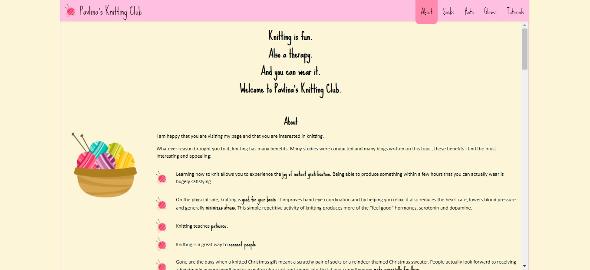
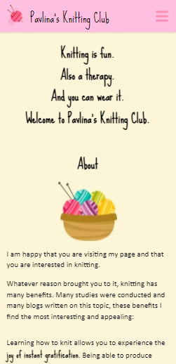

### freeCodeCamp > Responsive Web Design Projects

# Build a Product Landing Page

This is a solution to the freeCodeCamp's [Build a Product Landing Page](https://www.freecodecamp.org/learn/responsive-web-design/responsive-web-design-projects/build-a-product-landing-page) project. Projects are ment to apply all of the skills, principles, and concepts learned so far: HTML, CSS, Visual Design, Accessibility, and more.

## Table of contents

- [Overview](#overview)
  - [The challenge](#the-challenge)
  - [Screenshot](#screenshot)
  - [Links](#links)
- [My process](#my-process)
  - [Built with](#built-with)
  - [What I learned](#what-i-learned)
  - [Continued development](#continued-development)
- [Author](#author)
- [Acknowledgments](#acknowledgments)

## Overview

### The challenge
- Users complete 15 User Stories to pass the test
- Users can use HTML, JavaScript, and CSS to complete this project
- Plain CSS is recommended

### Screenshot

| Desktop layout |
|:--:|



| Mobile layout |
|:--:|


### Links

- Solution URL: https://github.com/PavlinaPs/Project3-ProductLandingPage
- Live Site URL: https://pavlinaps.github.io/Project3-ProductLandingPage/

## My process

### Built with

- Semantic HTML5 markup
- CSS Grid
- Flexbox
- JavaScrpt

### What I learned

This is my first project where I used hamburger menu and navbar showing current active section.

I know there are different opinions on the hamburger menu. I think users got used to it and almost expect it. My mom does. Anyway I shoud know how to create it, with two icons or three \<span> elements.

The biggest challenge in this project was to make sure, that after clicking on navigation, the section titles are not hidden behind navbar because of its position: fixed.

This css works for me:
```css
html, 
body {
  height: 100%;
  ..
}

main {
  ..
  overflow: auto;
  ..
}
```

Here is the link to Stack Overflow
https://stackoverflow.com/questions/4069734/fixed-header-footer-with-scrollable-content

### Continued development

I am planning to focus on accessibility features:
- review whether the html can be more semantic
- add class .sr-only for screen readers
- add ARIA attributes
- dark mode, contrast
- tabindex

And also I would like to create a page with my navbar snippets.

## Author

- GitHub - [PavlinaPs](https://github.com/PavlinaPs)
- Frontend Mentor - [@PavlinaPs](https://www.frontendmentor.io/profile/PavlinaPs)

## Acknowledgments

I would like to say a big Thank You to freeCodeCamp for everyting they do and for all I have already learned from them.
